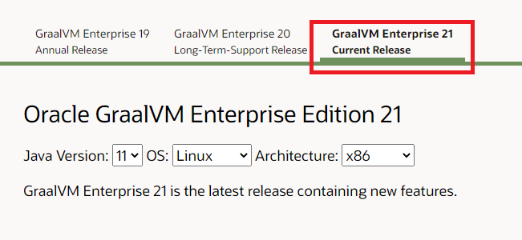
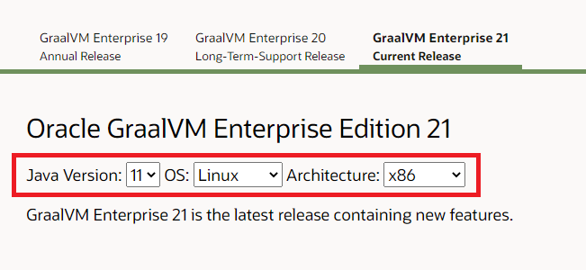
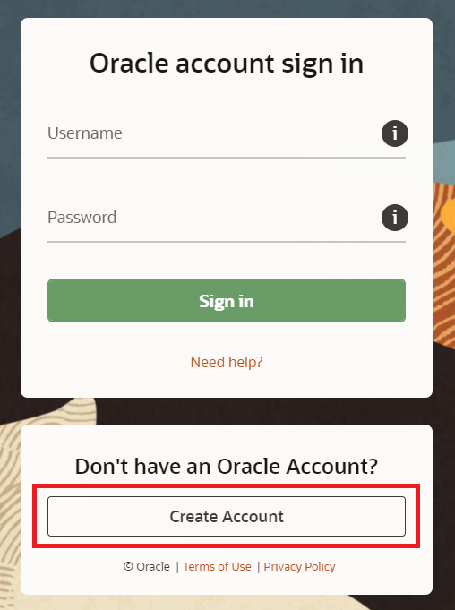

# Installing GraalVM Enterprise Edition and Setup

This guide, will walk you through the process of getting setup with GraalVM (in this example, GraalVM Enterprise Edition 21.0.0). 

## Notes on Mac Setup
These instructions are focused on installing on Linux and Mac. If you install on a Mac, a number of the details will vary from the general approach.

First, if you direct `GRAAL_HOME` to `/Library/Java/JavaVirtualMachines/`, MacOS picks the JDK as default-jdk (as long it’s the newest JDK in the directory). You may not want this outcome. 

Secondly, the path that the core GraalVM extracts differs from that of Linux. For Mac, it adds a few sub-directories and the directory that will be used as your `GRAALVM_HOME` will be relative to the directory that you extracted to:

    <install-dir>/graalvm-ee-java11-21.0.0/Contents/Home

The third major difference is that on some versions of OSX, the `GateKeeper` service on OSX will block you from running `GraalVM` as it is not a signed application / binary. We can work around this challenge in a number of ways:

* Disabling `GateKeeper`, running and then reenabling
* On latter versions of OSX, you will be prompted that GraalVM is blocked and `GateKeeper` will prompt you to add an exception
* You can allow access by using the `spctl` tool:

    ~~~ {.bash}
    # Run from the terminal
    # This assumes that you install /Library/Java/...
    # Please update if you choose to install in another location
    $ sudo spctl add $GRAALVM/bin/java
    ~~~

## Downloading GraalVM, Enterprise Edition 21.0.0

It is important to state that are there are two versions of `GraalVM`, the Enterprise Edition (supported and with better performance) and the Community Edition (free and Open Source).

Both of these can be dwonloaded from the GraalVM website, but these instructions will detail download and installation of the Enterprise Edition.

The Enterprise Edition download can be found at: [https://www.oracle.com/downloads/graalvm-downloads.html?selected_tab=21](https://www.oracle.com/downloads/graalvm-downloads.html?selected_tab=21)

You should see the following when you access the Download Page:

Click on the Current Release tab on the page, see image below, to display the download links for the current version. Make sure that you select the correct current minor version for the current release (the default should be selected already), the correct JDK version (8 or 11? Or both?) and the OS. Again, these are all are highlighted on the image below. The click on the "Download All" button.

You will be asked to accept the license agreement (OTN license, this means that you can use GraalVM EE for evaulation and development purposes). It will then ask you to log into Oracle. If you have an Oracle OTN account then use this identity to download GraalVM. If not, create one by hitting the "Create Acount" button at the bottom of the page:

After downloading the Core, highlighted in the steps above, you can download any of the following optional package / languages for GraalVM. All of these are available from the page we downloaded the core:

Please download the following optional packages:

* Oracle GraalVM Enterprise Edition Native Image
* GraalVM LLVM Toolchain Plugin

Optional plugins for GraalVM: 

* Ideal Graph Visualizer
* Oracle GraalVM Enterprise Edition Ruby Language Plugin
* Oracle GraalVM Enterprise Edition Python Language Plugin
* Oracle GraalVM Enterprise Edition WebAssembly Language Plugin
* Oracle GraalVM Enterprise Edition Java on Truffle
* GraalVM R Language Plugin* (GitHub download)

## Installing GraalVM

The full instructions on getting setup, can be found here, [Installing ](https://www.graalvm.org/docs/getting-started/#install-graalvm).

A quick summary of the steps outlined in the link above are:

1. Download the latest version of GraalVM EE for your OS, from [Download](https://www.oracle.com/downloads/graalvm-downloads.html)
    - See earlier section, Downloading GraalVM
2. You will need to download the following packages:
    - Oracle GraalVM Enterprise Edition for JDK11 (Version 21.0.0)
    - Oracle GraalVM Enterprise Editipon Native Image Early Adopter based on JDK11 (Version 21.0.0)
    - GraalVM LLVM Toolchain Plugin (Version 21.0.0)
    - Oracle GraalVM Enterprise Edition Python for JDK11 (Version 21.0.0)
    - Oracle GraalVM Enterprise Edition Ruby for JDK11 (Version 21.0.0)
3. Install the downloaded GraalVM EE core. This is a `tar.gz` file. You will need to extract it to a location that works for you and that will then become the root of your install. For example: `~/bin/graal/graalvm-ee-java11-21.0.0`
4. Update your environment in order to add a `GRAALVM_HOME` and add this to the path. You can do this by updating your shell startup script in `~/.bash_rc` or `~/.zshrc`:

    ~~~ {.bash}
    # Using the JDK11 version.
    export GRAALVM_HOME=~/bin/graal/graalvm-ee-java11-21.0.0
    export JAVA_HOME="${GRAALVM_HOME}"
    # Add the bin dir of GraalVM to your path, so you will be able to reference the exes
    export PATH="${GRAALVM_HOME}/bin:$PATH"
    ~~~

#### Installing on Mac

On Mac, when you extract the downloaded GraalVM (the core download, not the language packages), the path is slightly different to Linux. For example:

~~~ {.bash}
# Using the JDK11 version.
export GRAALVM_HOME=~/bin/graal/graalvm-ee-java11-21.0.0/Contents/Home
export JAVA_HOME=${GRAALVM_HOME}
# Add the bin dir of GraalVM to your path, so you will be able to reference the exes
export PATH=${GRAALVM_HOME}/bin:$PATH
~~~

**NB**: Note that the `Home` directory for GraalVM contains extra directories from what it does on Linux, `Contents/Home`.

### Testing Your Installation

Create a new shell (or source your shell script) and type the following:

~~~ {.bash}
$ java -version
java version "11.0.10" 2021-01-19 LTS
Java(TM) SE Runtime Environment GraalVM EE 21.0.0 (build 11.0.10+8-LTS-jvmci-21.0-b06)
Java HotSpot(TM) 64-Bit Server VM GraalVM EE 21.0.0 (build 11.0.10+8-LTS-jvmci-21.0-b06, mixed mode, sharing)
~~~

> #### Mac - GateKeeper
> On OSX you may see a pop-up warning you that the `java` is not a signed application and can not be run. This is not something to worry about, it is just OSX being over protectve :)
> See the earlier section of this page on the Mac specific steps on installing GraalVM (you need to let the `GateKeeper` service know that GraalVm is safe to be run).

Did you see the same output as above? If so, then it worked.

Test out the `gu` package tool:

~~~ {.bash}
$ gu --help
~~~

Did that work? If it did you now have access to the package tool that will allow you to install the various additional packages available with GraalVM. We will demonstrate a few of these shortly.

### Installing Language Modules

We use the `gu` package tool to install the extra additional modules that you can use with GraalVM, such as the various language runtimes. In this section, we will step through the installation process.

All language / component installations are executed using the `gu` tool distributed with GraalVM. The latest instructions on using this tool can be found at:

[gu Tool - Enterprise Edition](https://docs.oracle.com/en/graalvm/enterprise/20/guide/reference/graalvm-updater.html)

#### Installing JS / Node

Nothing to do here, these are available by default.

You can test the `node` and `JS` tooling as follows:

~~~ {.bash}
$ node --help
$ js --show-version
~~~

Both of the above commands will make reference to GraalVM and the version. If you have node already installed, you may need to change your path or explicitly specify the path to the GraalVM version of node

### Installing the llvm-toolchain

A number of the packages require the `llvm-toolchain` in order to work. Regardless of whether you are using the Enterprise or Community Edition, you will need to install the same version.

This is installed simply using the `gu` command:

~~~ {.bash}
$ gu install -L <DOWNLOAD-DIR>/llvm-toolchain-installable-java11-darwin-amd64-21.0.0.jar
~~~

#### Installing Native Image

Full instructions can be found [here](https://www.graalvm.org/docs/reference-manual/native-image/#install-native-image), but the process is very similar to that for Python.

1. Ensure you have the prerequisite libs available on your system: `glibc-devel, zlib-devel`
    - On linux these can be installed using your package manager
    - On OSX you will need to ensure that
2. `$ gu install -L <DOWNLOAD-DIR>/native-image-installable-svm-svmee-java11-darwin-amd64-21.0.0.jar`
3. Test the installation with: `native-image --version`

### Intalling Ruby

Full instructions can be found [here](https://www.graalvm.org/docs/reference-manual/languages/ruby/#installing-ruby).

But the basic steps are:

1. `$gu install -L <DOWNLOAD-DIR>/ruby-installable-svm-svmee-java11-linux-amd64-21.0.0.jar`

Test that your installation works by running ruby:

~~~ {.bash}
$ which ruby
$ ruby --version
~~~

If you already have Ruby installed, then you will need to adjust your path or use the full path to the ruby binary.

#### Installing Python

Full instructions can be found [here](https://www.graalvm.org/docs/reference-manual/languages/python/#installing-python).

But the basic steps are:

1. `$ gu -L install <DOWNLOAD-DIR>/python-installable-svm-svmee-java11-linux-amd64-21.0.0.jar`
2. Test that Python is now installed:

~~~ {.bash}
$ gu list
# You should see that Python EE version 21.0.0 is now installed
$ graalpython
~~~

#### Installing R

Full instructions can be found [here](https://www.graalvm.org/docs/reference-manual/languages/r/#installing-r).

When installing the R language module, it is best to consult the installation page, above, as thwere are a number of prerequisites that need to be installed.

### Install Visual Studio Code

A number of plugins ahve been written for this editor, that allow for better integration with the GraalVM eco-system.

You are more than welcome to use another editor. When it comes to the polyglot debugging, please make sure that you have the Google Chrome browser installed.

### Install VS Code Plugins

Please install the following plugins:

1. GraalVM Extension Pack [download](https://marketplace.visualstudio.com/items?itemName=oracle-labs-graalvm.graalvm)

This will install all of the individual extensions.

## Docker - Pre-built Docker Images

GraalVM is available on a number of pre-built container images that can be downloaded from GitHub. Currently only the Community Edition is available.

You can find the Docker Images [here](https://github.com/orgs/graalvm/packages/container/package/graalvm-ce).
