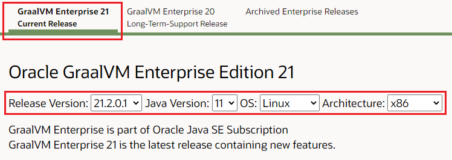

# Installing GraalVM Enterprise Edition and Setup

This guide will walk you through the process of installing GraalVM (in this example, GraalVM Enterprise Edition 21.2.0). 

For an optimal lab experience, please install the following tools: `git`, `curl`, `unzip`, Docker or Podman, Apache Maven and your favorite IDE (optional).

## Downloading GraalVM Enterprise Edition 21.2.0

It is important to note there are two versions of `GraalVM`, the Enterprise Edition (supported and with better performance) and the Community Edition (free and Open Source).

Both of these can be downloaded from the GraalVM website, but these instructions will detail download and installation of the Enterprise Edition.

The Enterprise Edition download can be found at: [https://www.oracle.com/downloads/graalvm-downloads.html?selected_tab=21](https://www.oracle.com/downloads/graalvm-downloads.html?selected_tab=21)

You should see the following when you access the Download Page:



Click on the `Current Release` tab on the page to display the download links for the current version. Choose the Release Version, Java Version, OS and Architecture then click on the "Download" icon(s).

You will be asked to accept the Oracle License Agreement. 


It will then ask you to log into Oracle. If you have an Oracle OTN account then use this identity to download GraalVM. If not, create one by hitting the "Create Account" button at the bottom of the page:


After downloading the Core (highlighted in the steps above), you can download any of the following optional modules/languages for GraalVM. All of these are available from the page we downloaded the core:

Please download the following optional modules:

* Oracle GraalVM Enterprise Edition Native Image module
* GraalVM LLVM Toolchain module

Optional modules for GraalVM: 

* Ideal Graph Visualizer
* Oracle GraalVM Enterprise Edition Ruby Language module
* Oracle GraalVM Enterprise Edition Python Language module
* Oracle GraalVM Enterprise Edition WebAssembly Language module
* Oracle GraalVM Enterprise Edition Java on Truffle
* GraalVM R Language module* (GitHub download)

## Installing GraalVM

The full instructions on setup can be found [here](https://docs.oracle.com/en/graalvm/enterprise/21/docs/getting-started/#install-graalvm-enterprise).

A quick summary of the steps outlined in the link above are:

1. Download the latest version of GraalVM EE for your OS from the [Download page](https://www.oracle.com/downloads/graalvm-downloads.html)
    - See earlier section, Downloading GraalVM
2. You will need to download the following modules:
    - Oracle GraalVM Enterprise Edition for JDK11 (Version 21.2.0)
    - Oracle GraalVM Enterprise Edition Native Image Early Adopter based on JDK11 (Version 21.2.0)
    - GraalVM LLVM Toolchain module (Version 21.2.0)
    - Oracle GraalVM Enterprise Edition Python for JDK11 (Version 21.2.0)
    - Oracle GraalVM Enterprise Edition Ruby for JDK11 (Version 21.2.0)
3. Install the downloaded GraalVM EE core. This is a `tar.gz` file. You will need to extract it to a location that works for you and that will then become the root of your install. For example: `~/bin/graal/graalvm-ee-java11-21.2.0`
4. Update your environment in order to add a `GRAALVM_HOME` and add this to the path. You can do this by updating your shell startup script in `~/.bash_rc` or `~/.zshrc`:

    ~~~ {.bash}
    # Using the JDK11 version.
    export GRAALVM_HOME=~/bin/graal/graalvm-ee-java11-21.2.0
    export JAVA_HOME="${GRAALVM_HOME}"
    # Add the bin dir of GraalVM to your path, so you will be able to reference the exes
    export PATH="${GRAALVM_HOME}/bin:$PATH"
    ~~~


#### Installing on Mac

If you install on MacOS, a number of the details will vary from the general Linux approach.  See full instructions [here](https://docs.oracle.com/en/graalvm/enterprise/21/docs/getting-started/installation-macos/).

First, if you direct `GRAALVM_HOME` to `/Library/Java/JavaVirtualMachines/`, MacOS picks the JDK as default-jdk (as long it’s the newest JDK in the directory). You may not want this outcome. 

Secondly, the path that the core GraalVM extracts differs from that of Linux. For Mac, it adds a few sub-directories and the directory that will be used as your `GRAALVM_HOME` will be relative to the directory that you extracted to:

    <install-dir>/graalvm-ee-java11-21.2.0/Contents/Home

<!--The third major difference is that on some versions of OSX, the `GateKeeper` service on OSX will block you from running `GraalVM` as it is not a signed application / binary. We can work around this challenge in a number of ways:

* Disabling `GateKeeper`, running and then reenabling
* On latter versions of OSX, you will be prompted that GraalVM is blocked and `GateKeeper` will prompt you to add an exception
* You can allow access by using the `spctl` tool:

    ~~~ {.bash}
    # Run from the terminal
    # This assumes that you install /Library/Java/...
    # Please update if you choose to install in another location
    $ sudo spctl add $GRAALVM/bin/java
    ~~~
-->    

Also, if you are using MacOS Catalina and later you may need to remove the quarantine attribute from the bits before you can use them. To do this, run the following:

```
$ sudo xattr -r -d com.apple.quarantine /path/to/GRAALVM_HOME
```

On MacOS, when you extract the downloaded GraalVM (the core download, not the language packages), the path is slightly different to Linux. For example:

~~~ {.bash}
# Using the JDK11 version.
export GRAALVM_HOME=~/bin/graal/graalvm-ee-java11-21.2.0/Contents/Home
export JAVA_HOME=${GRAALVM_HOME}
# Add the bin dir of GraalVM to your path, so you will be able to reference the exes
export PATH=${GRAALVM_HOME}/bin:$PATH
~~~


### Testing Your Installation

Create a new shell (or source your shell script) and type the following:

~~~ {.bash}
$ java -version
java version "11.0.12" 2021-07-20 LTS
Java(TM) SE Runtime Environment GraalVM EE 21.2.0.1 (build 11.0.12+8-LTS-jvmci-21.2-b08)
Java HotSpot(TM) 64-Bit Server VM GraalVM EE 21.2.0.1 (build 11.0.12+8-LTS-jvmci-21.2-b08, mixed mode, sharing)
~~~

> #### Mac - GateKeeper
> On OSX you may see a pop-up warning you that the `java` is not a signed application and can not be run. This is not something to worry about, it is just OSX being over protective :)
> See the earlier section of this page on the Mac specific steps on installing GraalVM (you need to let the `GateKeeper` service know that GraalVm is safe to be run).

Did you see the same output as above? If so, then it worked!

Test out the `gu` package tool:

~~~ {.bash}
$ gu --help
~~~

Did that work? If so, you now have access to the package tool that allows you to install various additional modules available with GraalVM.

### Installing Language Modules

We use the `gu` package tool to install the additional modules that you can use with GraalVM, such as the various language runtimes. In this section, we will step through the installation process.

All language / component installations are executed using the `gu` tool distributed with GraalVM. The latest instructions on using this tool can be found at:

[gu Tool - Enterprise Edition](https://docs.oracle.com/en/graalvm/enterprise/21/guide/reference/graalvm-updater.html)

#### Installing Native Image

Full instructions can be found [here](https://docs.oracle.com/en/graalvm/enterprise/21/docs/getting-started/#native-images).

1. Ensure you have the prerequisite libs available on your system: `glibc-devel, zlib-devel`
    - On linux these can be installed using your package manager
    - On OSX you will need to ensure that `xcode` is installed: `xcode-select --install`
2. `$ gu install -L <DOWNLOAD-DIR>/native-image-installable-svm-svmee-java11-darwin-amd64-21.2.0.jar`
3. Test the installation with: `native-image --version`


#### Installing JS / Node

Nothing to do here, these are available by default.

You can test the `node` and `JS` tooling as follows:

~~~ {.bash}
$ node --help
$ js --show-version
~~~

Both of the above commands will make reference to GraalVM and the version. If you have node already installed, you may need to change your path or explicitly specify the path to the GraalVM version of node

#### Installing the llvm-toolchain

A number of the packages require the `llvm-toolchain` in order to work. Regardless of whether you are using the Enterprise or Community Edition, you will need to install the same version.

This is installed simply using the `gu` command:

~~~ {.bash}
$ gu install -L <DOWNLOAD-DIR>/llvm-toolchain-installable-java11-darwin-amd64-21.2.0.jar
~~~

#### Installing Ruby

Full instructions can be found [here](hhttps://docs.oracle.com/en/graalvm/enterprise/21/docs/getting-started/#ruby).

But the basic steps are:

1. `$gu install -L <DOWNLOAD-DIR>/ruby-installable-svm-svmee-java11-linux-amd64-21.2.0.jar`

Test that your installation works by running ruby:

~~~ {.bash}
$ which ruby
$ ruby --version
~~~

If you already have Ruby installed, then you will need to adjust your path or use the full path to the ruby binary.

#### Installing Python

Full instructions can be found [here](https://docs.oracle.com/en/graalvm/enterprise/21/docs/getting-started/#python).

But the basic steps are:

1. `$ gu -L install <DOWNLOAD-DIR>/python-installable-svm-svmee-java11-linux-amd64-21.2.0.jar`
2. Test that Python is now installed:

~~~ {.bash}
$ gu list
# You should see that Python EE version 21.2.0 is now installed
$ graalpython
~~~

#### Installing R

Full instructions can be found [here](https://docs.oracle.com/en/graalvm/enterprise/21/docs/getting-started/#r).

When installing the R language module, it is best to consult the installation page, above, as there are a number of prerequisites that need to be installed.

### Install Visual Studio Code

A number of modules have been developed for Microsoft VSCode that allow for better integration with the GraalVM eco-system.

Of course, you are welcome to use another IDE. When it comes to the polyglot debugging, please make sure that you have the Google Chrome browser installed.

### Install VS Code modules

Please install the following modules:

1. GraalVM Extension Pack [download](https://marketplace.visualstudio.com/items?itemName=oracle-labs-graalvm.graalvm)

This will install all of the individual extensions.

## Docker - Pre-built Docker Images

GraalVM is available on a number of pre-built container images that can be downloaded from GitHub. Currently only the Community Edition is available.

You can find the Docker Images [here](https://github.com/orgs/graalvm/packages/container/package/graalvm-ce).

## Upgrading GraalVM

GraalVM includes a command-line utility called GraalVM Updater (`gu`) to install and manage optional GraalVM language runtimes and utilities. As of version 21.0.0, GraalVM Updater has become more efficient, and can be used to update your local GraalVM installation to a newer version or upgrade from a Community to Enterprise Edition.

GraalVM Updater will attempt to download the latest version of either GraalVM Enterprise or GraalVM Community Edition, if available. It will not rewrite the existing installation, but unpack it into a new directory and print out the location path. It will also verify if you have any optional components installed in the current GraalVM installation and update those as well. If the “parent” installation contains a symlink to the current GraalVM installation, that symlink will be updated. If your setup involves some environment variables (e.g., PATH) pointing to a selected GraalVM installation, those variables should be updated manually. *(See note below regarding SDKMAN)*

In the following example, the current GraalVM version is 20.3.0, we'll be upgrading to the latest version (21.2.0.1):

```
$ sudo gu upgrade
Password:
Downloading: Release index file from oca.opensource.oracle.com
Downloading: Component catalog for GraalVM Enterprise Edition 21.0.0.2 on jdk11 from oca.opensource.oracle.com
Downloading: Component catalog for GraalVM Enterprise Edition 21.2.0 on jdk11 from oca.opensource.oracle.com
Downloading: Component catalog for GraalVM Enterprise Edition 21.2.0.1 on jdk11 from oca.opensource.oracle.com
Downloading: Component catalog for GraalVM Enterprise Edition 21.0.0 on jdk11 from oca.opensource.oracle.com
Downloading: Component catalog for GraalVM Enterprise Edition 21.1.0 on jdk11 from oca.opensource.oracle.com
Skipping ULN EE channels, no username provided.
Downloading: Component catalog from www.graalvm.org

=========================================================================
	Preparing to install GraalVM Core version 21.2.0.1.
	Destination directory: /Library/Java/JavaVirtualMachines/graalvm-ee-java11-21.2.0.1
=========================================================================
The component(s) GraalVM Core requires to accept the following license: GraalVM Enterprise Edition License
Enter "Y" to confirm and accept all the license(s). Enter "R" to the see license text.
Any other input will abort installation:  **Y**
Downloading: Contents of "GraalVM Enterprise Edition License" from oca.opensource.oracle.com
Please provide an e-mail address to not show the license check again (optional). You may want to check Oracle Privacy Policy (https://www.oracle.com/legal/privacy/privacy-policy.html).
Enter a valid e-mail address: **<your-email-address>**
Downloading: Component core: GraalVM Core  from oca.opensource.oracle.com          ]
Downloading: Component org.graalvm: GraalVM Core  from oca.opensource.oracle.com
Installing GraalVM Core version 21.2.0.1 to /Library/Java/JavaVirtualMachines/graalvm-ee-java11-21.2.0.1...
Copying license info from 21.0.0 to 21.2.0.1.
Warning: Could not migrate GDS settings
Processing Component: Native Image
Processing Component: Graal.Python
Downloading: Release index file from oca.opensource.oracle.com
Downloading: Component catalog for GraalVM Enterprise Edition 21.2.0 on jdk11 from oca.opensource.oracle.com
Downloading: Component catalog for GraalVM Enterprise Edition 21.2.0.1 on jdk11 from oca.opensource.oracle.com
Processing Component: GraalWasm
Processing Component: FastR
Processing Component: TruffleRuby
Processing Component: Java on Truffle
Processing Component: LLVM.org toolchain
Additional Components are required:
    LLVM.org toolchain (org.graalvm.llvm-toolchain, version 21.2.0.1), required by: Graal.Python (org.graalvm.python)
The component(s) Native Image requires to accept the following license: Oracle GraalVM Enterprise Edition Native Image License
Enter "Y" to confirm and accept all the license(s). Enter "R" to the see license text.
Any other input will abort installation:  **Y**
Downloading: Contents of "Oracle GraalVM Enterprise Edition Native Image License" from oca.opensource.oracle.com
Downloading: Component org.graalvm.native-image: Native Image  from oca.opensource.oracle.com
Downloading: Component org.graalvm.python: Graal.Python  from oca.opensource.oracle.com
Downloading: Component org.graalvm.wasm: GraalWasm  from oca.opensource.oracle.com
Downloading: Component org.graalvm.R: FastR  from github.com
Downloading: Component org.graalvm.ruby: TruffleRuby  from oca.opensource.oracle.com
Downloading: Component org.graalvm.espresso: Java on Truffle  from oca.opensource.oracle.com
Please provide an e-mail address to not show the license check again (optional). You may want to check Oracle Privacy Policy (https://www.oracle.com/legal/privacy/privacy-policy.html).
Enter a valid e-mail address: **<your-email-address>**
Downloading: Component org.graalvm.llvm-toolchain: LLVM.org toolchain  from oca.opensource.oracle.com
Installing new component: LLVM.org toolchain (org.graalvm.llvm-toolchain, version 21.2.0.1)
Installing new component: Native Image (org.graalvm.native-image, version 21.2.0.1)
Installing new component: Graal.Python (org.graalvm.python, version 21.2.0.1)
Installing new component: GraalWasm (org.graalvm.wasm, version 21.2.0.1)
Installing new component: FastR (org.graalvm.R, version 21.2.0)
Installing new component: TruffleRuby (org.graalvm.ruby, version 21.2.0.1)
Installing new component: Java on Truffle (org.graalvm.espresso, version 21.2.0.1)
NOTES:
---------------
FastR should work out of the box on most Linux distributions and recent MacOS versions. Run the following script to check FastR requirements and create a personal R packages library directory:
    /Library/Java/JavaVirtualMachines/graalvm-ee-java11-21.2.0.1/Contents/Home/languages/R/bin/configure_fastr

The R component comes without native image by default. If you wish to build the native image, which provides faster startup, but slightly slower peak performance, then run the following:
    gu rebuild-images R

The native image is then used by default. Pass '--jvm' flag to the R or Rscript launcher to use JVM instead of the native image. Note that the native image is not stable yet and is intended for evaluation and experiments for curious users. Some features may not work in the native image mode. Most notably, the --polyglot switch works only in JVM mode (when --jvm is used).

See http://www.graalvm.org/docs/reference-manual/languages/r for more.


IMPORTANT NOTE:
---------------
The Ruby openssl C extension needs to be recompiled on your system to work with the installed libssl.
First, make sure TruffleRuby's dependencies are installed, which are described at:
  https://github.com/oracle/truffleruby/blob/master/README.md#dependencies
Then run the following command:
        /Library/Java/JavaVirtualMachines/graalvm-ee-java11-21.2.0.1/Contents/Home/languages/ruby/lib/truffle/post_install_hook.sh


This version of Java on Truffle is experimental. We do not recommended it for production use.

Usage: java -truffle [-options] class [args...]
           (to execute a class)
    or java -truffle [-options] -jar jarfile [args...]
           (to execute a jar file)

To rebuild the polyglot library:
    gu rebuild-images libpolyglot -cp ${GRAALVM_HOME}/lib/graalvm/lib-espresso.jar


IMPORTANT NOTE:
---------------
Set of GraalVM components that provide language implementations have changed. The Polyglot native image and polyglot native C library may be out of sync:
- new languages may not be accessible
- removed languages may cause the native binary to fail on missing resources or libraries.
To rebuild and refresh the native binaries, use the following command:
        /Library/Java/JavaVirtualMachines/graalvm-ee-java11-21.2.0.1/Contents/Home/bin/gu rebuild-images
```

**Note:** If you're using SDKMAN, you will need to install a new Java version linking the newly upgraded GraalVM.

For example:

`
$ sdk install java 21.2.0.1-r11-ee /Library/Java/JavaVirtualMachines/graalvm-ee-java11-21.2.0.1/Contents/Home
`

Confirm both GraalVM and all of the modules were upgraded:

```
$ java -version
java version "11.0.12" 2021-07-20 LTS
Java(TM) SE Runtime Environment GraalVM EE 21.2.0.1 (build 11.0.12+8-LTS-jvmci-21.2-b08)
Java HotSpot(TM) 64-Bit Server VM GraalVM EE 21.2.0.1 (build 11.0.12+8-LTS-jvmci-21.2-b08, mixed mode, sharing)
```

```
$ gu list
ComponentId              Version             Component name                Stability                     Origin
---------------------------------------------------------------------------------------------------------------------------------
graalvm                  21.2.0.1            GraalVM Core                  -
R                        21.2.0              FastR                         Experimental                  github.com
espresso                 21.2.0.1            Java on Truffle               Experimental                  oca.opensource.oracle.com
js                       21.2.0.1            Graal.js                      Supported
llvm-toolchain           21.2.0.1            LLVM.org toolchain            Supported                     oca.opensource.oracle.com
native-image             21.2.0.1            Native Image                  Early adopter                 oca.opensource.oracle.com
python                   21.2.0.1            Graal.Python                  Experimental                  oca.opensource.oracle.com
ruby                     21.2.0.1            TruffleRuby                   Experimental                  oca.opensource.oracle.com
wasm                     21.2.0.1            GraalWasm                     Experimental                  oca.opensource.oracle.com
```

